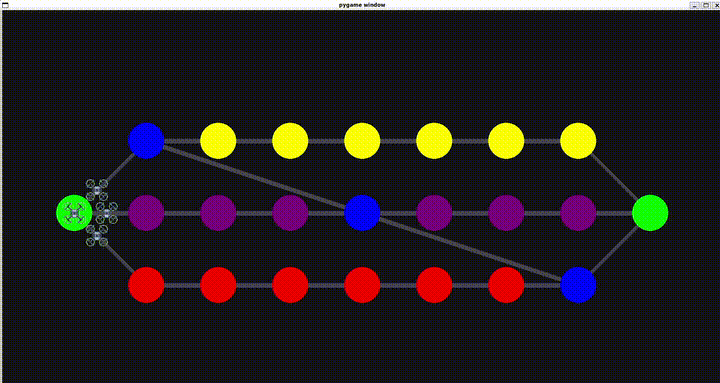

# Fly-in: Multi-Agent Drone Routing & Orchestration

  

*This project was developed by mapadron as part of the 42 curriculum.*

---

## 📑 Table of Contents

* [About the Project](#about-the-project)
* [Features](#features)
* [Installation & Usage](#installation--usage)
* [File Format](#file-format)
* [Simulation & Controls](#simulation)
* [How It Works](#how-it-works)
* [Tools Used](#tools-used)
* [Demo](#demo)

## 📖 About the Project <a id="about-the-project"></a>

**Fly-in** is a high-performance fleet management and pathfinding system developed as part of the 42 curriculum. It solves the complex problem of routing a fleet of through a constrained graph network balancing path length against network throughput to minimize total mission time.

The core of the project is an optimization challenge: navigating drones from a starting hub to a target hub in the fewest possible turns. Unlike simple shortest-path problems, **Fly-in** introduces capacity constraints on both nodes and edges, requiring a solution that can manage "traffic jams" by dispatching drones across multiple parallel paths simultaneously.

The project demonstrates the application of **Min-Cost Max-Flow (MCMF)** theory to solve a discrete-time logistics problem.

## ✨ Features <a id="features"></a>

* **Optimal Pathfinding:** Implements a Successive Shortest Path algorithm to find the mathematically optimal number of parallel routes.


* **Dynamic Constraint Handling:**
* **Hub Capacities:** Limits the number of drones that can occupy a node at once.


* **Link Capacities:** Limits the number of drones traversing a connection per turn.


* **Zone Types:** Supports **Priority** zones (preferred routes), **Restricted** zones (2-turn traversal cost), and **Blocked** zones.

* **Real-Time Simulation:** A discrete-time engine that executes and validates every move.


* **Graphical Visualizer:** A Pygame-based GUI providing real-time visual feedback of drone movements and bottlenecking.


* **Production-Grade Code:** Fully compliant with `flake8` and `mypy --strict` standards, following strict Object-Oriented Programming (OOP) principles.

## 🚀 Installation & Usage <a id="installation--usage"></a>

### Prerequisites

* Python 3.10+
* Make

### Setup

The project includes a `Makefile` to automate environment setup:

```bash
# Install dependencies and setup virtual environment
make install

# Run the simulation with the default configuration
make run

```

### Manual Execution

```bash
source .venv/bin/activate
python3 a_maze_ing.py <map_file.txt>

```

## 📄 File Format <a id="file-format"></a>

The system parses custom map files that define the network topology and mission parameters.

```text
# Total number of drones to route
nb_drones: 5

# hub: name x y [metadata]

# Starting hub
start_hub: hub 0 0 [color=green]
# Target hub
end_hub: goal 10 10 [color=yellow]

hub: roof1 3 4 [zone=restricted color=red]
hub: roof2 6 2 [zone=normal color=blue]
hub: corridorA 4 3 [zone=priority color=green max_drones=2]
hub: tunnelB 7 4 [zone=normal color=red]
hub: obstacleX 5 5 [zone=blocked color=gray]

# connection: hub1-hub2 [metadata]
connection: hub-roof1
connection: hub-corridorA
connection: roof1-roof2
connection: roof2-goal
connection: corridorA-tunnelB [max_link_capacity=2]
connection: tunnelB-goal

```

The project ensures robust error handling:

* **Strict Validation**: Any formatting errors (negative capacities, invalid coordinates, unknown zone types) are caught during parsing.

* **Meaningful Messages**: Instead of crashing, the program provides clear feedback indicating the exact line and value that failed validation.

* **Stability**: The system is engineered to prevent unexpected crashes during execution, ensuring a smooth experience even with malformed input.

## ⚙️ Simulation & Controls <a id="simulation"></a>

The simulation proceeds in discrete turns, where drones move simultaneously as long as capacity constraints are respected. The simulation ends when all drones have reached the end zone.

### Interactive Graphics

The Pygame visualizer allows for real-time monitoring of the fleet with the following controls:

* **`Space`**: Pause/Resume the simulation.
* **`Esc`**: Exit the visualizer.
* **`Right Arrow`**: Increase simulation speed.
* **`Left Arrow`**: Decrease simulation speed.

### Output Log Explanation

The terminal log provides a frame-by-frame breakdown of the mission state:

* Each simulation turn is represented by a line.
* Each line lists all the drone movements that occur during that turn.
* Each movement follows the format: D\<ID\>-\<zone\> or D\<ID\>-\<connection\>
* Drones that do not move in a given turn are omitted from that line


## 🧠 How It Works <a id="how-it-works"></a>

### 1. The Optimization Formula

To minimize the total time $T$ , the algorithm calculates:

$$T = \left\lceil \frac{D + \sum_i L_i}{K} \right\rceil - 1$$

Where $D$ is the number of drones, $L_i$ represents path lengths (all with flow 1), and $K$ is the number of parallel paths.

### 2. Successive Shortest Path (MCMF)

Instead of a simple Dijkstra, the solver uses **Residual Graphs**. This allows the algorithm to "push back" flow—effectively rerouting drones from a short but narrow path to a longer but wider highway if it results in a lower total .

### 3. Lexicographical Costs

Costs are calculated as tuples `(Traversal_Time, -Priority_Bonus)`. This ensures that if two paths result in the same turn count, the algorithm automatically selects the one passing through the most Priority Hubs.

## 🛠️ Tools Used <a id="tools-used"></a>

* **Language:** Python 3.10+
* **Data Validation:** Pydantic (used to ensure strict type safety and schema validation for map parsing).
* **Graphics:** Pygame (for the interactive simulation).
* **Static Analysis:** MyPy (Strict mode) and Flake8 (to ensure 100% compliance with Python standards)
* **Automation:** GNU Make
* **Architecture:** Modular OOP (Separation of Concerns between Parser, Solver, and Simulator)

## 📺 Demo <a id="demo"></a>




